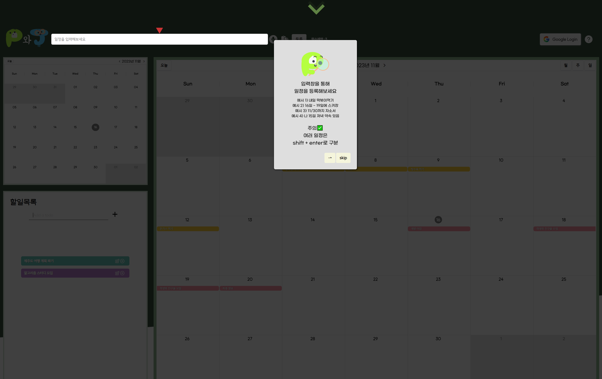
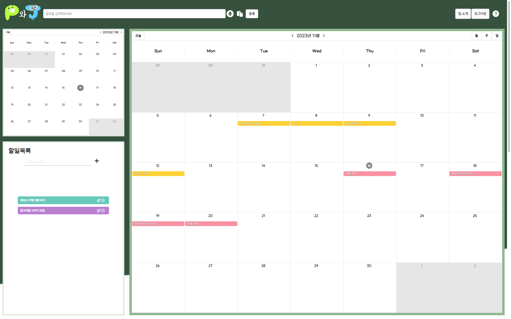

# P 와 J

일정을 계획적으로 설계하기에 어려움이 있는 P와 일정 설계에 편리함을 원하는 J를 위한 캘린더 서비스 P 와 J 입니다.

## 📅 개요
**개발 기간** : 2023.10.09 ~ 2023.11.17 (총 6주)

**기능**
- OAuth2.0을 통한 Google Login
- 서비스 내 캘린더로 Google Calendar 연동 일정 관리
- 시간 정보를 등록하지 않은 Todo 일정 관리
- 일상적인 대화, 요약된 글 등의 형식으로 일정을 등록
- 마이크 음성을 통해 일정을 등록
- 내 일정과 유사한 정보 추천

## 💡서비스 소개

### P 와 J

> 일정을 계획적으로 설계하기 어려운 P
> 
> 일정 설계에 편리함을 원하는 J
> 
> 모두에게 쉽고 빠른 일정 등록과 유사한 일정을 추천합니다.

 

### 배포 URL
> https://k9a601.p.ssafy.io/demo

 

### 서비스 화면

**초기 화면**

**기능 안내 튜토리얼**

**메인 캘린더**

**일정 기반 정보 추천 - 리스트**

**일정 기반 정보 추천 - 갤러리**

## 📋기술 스택

**💻 FRONTEND**

**Environment**

 

**Dependency**

 

**💻 BACKEND**

**Environment**

**Dependency**

**DB**

 

**💾 DATA**

**Environment**

 

**📠 INFRA**

## 역할 분담

| 
김혜진
 | 
조재웅
 | 
임대영
 | 
조준하
 | 
박승희
 | 
이성원
 |
| :-: | :-: | :-: | :-: | :-: | :-: 
| :crown: / DATA | BE / INFRA | BE | FE | FE | FE / DATA |
| 간편 일정 등록, 일정 기반 유사 정보 추천 알고리즘 | CI/CD 구축, 무중단 배포 | OAuth2.0, 캘린더 API | API 연동,소셜 로그인, Todo , 추천 갤러리 페이지 | Redux, 캘린더 동작, css, Drag & Drop | 데이터 분석, STT, Carousel 슬라이드 |

